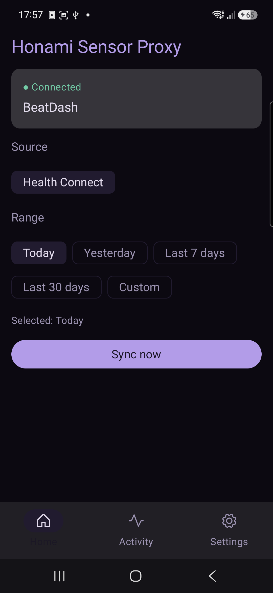
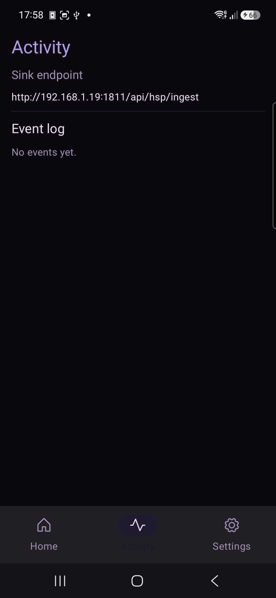
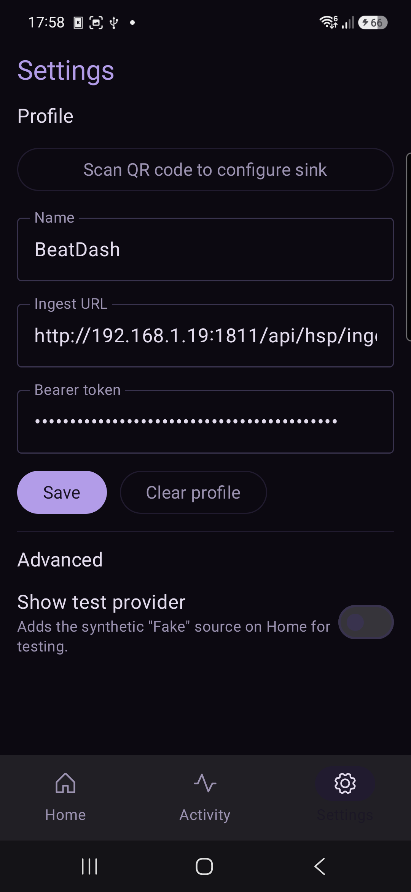

# Honami Sensor Proxy (HSP)

**A device-agnostic health/sensor → HTTP bridge for Android.**

HSP reads health data from whatever source is available on the device, normalizes it to one
canonical shape, and pushes it to a protected HTTP endpoint. It knows nothing about any specific
backend — every backend is just a configured **sink** that speaks a small, standard contract.

## Built to be integrated into other apps

HSP is **not** a fitness app. It has no charts, history, or analytics — that's your backend's job.
It's a reusable pipe: any backend that implements the ingest contract becomes a drop-in sink.

> **New project = new QR code, nothing else.** Your app renders a provisioning QR, the user scans
> it in HSP, and data starts flowing. No per-backend code lives in the app.

The reference backend is **[BeatDash](https://github.com/iamshiron/BeatDash)** — but nothing here
is BeatDash-specific. The full backend contract is documented in [`BridgeApp.md`](./BridgeApp.md).

## Screenshots

| Home | Activity | Settings |
|:---:|:---:|:---:|
|  |  |  |
| Pick a source + range and sync | Exact endpoint + event log | Scan a QR, manage the profile |

## How it works

```
 Health Connect ─┐
 (BLE / Wear) ───┼─►  normalize to Sample  ─►  batch  ─►  POST JSON envelope
 Fake (testing) ─┘    (metric + value +               with Authorization: Bearer <token>
                       unit + recordedAt)              to the configured sink
```

- **Provider-agnostic sources.** The first-class source is **Health Connect** — the on-device
  datastore that Samsung Health (and Fitbit, Google Fit, Zepp, Mi Fitness, …) sync into. One
  adapter therefore covers most of the Android wearable ecosystem. A synthetic **Fake** source is
  available for testing (Settings → Advanced).
- **One canonical sample.** Every source normalizes to the same `Sample` (`metric`, `value`,
  `unit`, `recordedAt`); every sink receives the same JSON envelope.
- **The wire is always Bearer.** Pushes are always `Authorization: Bearer <token>` (RFC 6750).
- **Secret-free, single profile.** One sink profile at a time, provisioned by QR and persisted
  securely — the bearer token is encrypted with an AndroidKeyStore AES-256-GCM key, never stored
  in plaintext.

## General setup guide

1. **On your target app / backend**, generate a provisioning **QR code** encoding a small JSON
   payload (see below).
2. **In HSP**, go to **Settings → Scan QR code to configure sink** and scan it.
3. **Done.** The profile (name + ingest URL + token) is saved securely and shown as *Connected* on
   Home. It survives app restarts, so setup is one-time.

You can also edit the ingest URL / token by hand in Settings — HSP is an open ecosystem, not a
walled garden.

### Provisioning QR payload

The QR carries a JSON object:

```json
{
  "v": 1,
  "name": "BeatDash",
  "ingest": "https://your-backend.example/api/hsp/ingest",
  "auth": "token",
  "token": "<opaque-bearer-token>",
  "metrics": ["heart_rate", "calories", "steps", "spo2"]
}
```

| Field | Meaning |
|-------|---------|
| `name` | Display label shown in the app |
| `ingest` | Full ingest URL, `POST`ed verbatim (`http://` allowed for local dev, `https://` in production) |
| `auth` / `token` | Tier-1 static bearer token minted by your backend |
| `metrics` | Which canonical metrics this sink wants (`heart_rate`, `calories`, `steps`, `spo2`) |

## Pushing data — how and when

Pushing is **user-initiated** from the Home screen:

1. Pick a **Source** (Health Connect).
2. Pick a **Range** — *Today*, *Yesterday*, *Last 7 days*, *Last 30 days*, or a *Custom* date range.
3. Tap **Sync now**. On first use, Android asks you to grant Health Connect read access.

HSP reads every recorded sample in that window and pushes it to your sink in batches. Because the
backend dedupes on `(subject, metric, recordedAt)`, **re-syncing an overlapping range is safe** —
duplicates are ignored. So a good rhythm is:

- **After a session/workout**, sync *Today* to ship the latest readings.
- **Occasionally**, sync *Last 7 days* to backfill anything the companion app synced late (Health
  Connect data is batched — the vendor app writes on its own schedule).

> **Tip for denser heart rate:** set your watch/companion app's HR monitoring to continuous or
> 1-minute. HSP can only push what the device actually recorded.

### BeatDash example

1. In BeatDash, open your health-integration settings and generate the HSP QR code (it embeds your
   personal ingest URL + a minted bearer token).
2. Scan it in HSP → Settings. Home now shows **Connected · BeatDash**.
3. After playing a set, open HSP and **Sync now** (*Today*). BeatDash matches the heart-rate samples
   to each play by `recordedAt` and shows them against your session.

## Building

Kotlin Multiplatform (Android + shared core; iOS is out of scope for now).

```bash
# Debug APK
./gradlew :androidApp:assembleDebug

# Unit tests (shared core: pipeline, provisioning, auth, historical push)
./gradlew :shared:testAndroidHostTest
```

- [`shared/`](./shared/src) — the portable core (model, sources, sinks, engine, provisioning) plus
  the Compose UI. `commonMain` holds everything platform-neutral; `androidMain` adds Health Connect,
  the QR scanner (CameraX + ML Kit), and Keystore-backed storage.
- [`androidApp/`](./androidApp) — the Android host.

Tooling is pinned via [`mise`](https://mise.jdx.dev) (`mise.toml`): JDK 21 for the Gradle daemon,
plus the Android SDK location.

## Security

- No client secret is embedded (public client).
- The bearer token is stored encrypted (AndroidKeyStore AES-256-GCM); only the ciphertext touches
  disk.
- Sinks should be HTTPS in production; cleartext `http://` is permitted for local-dev backends.

## License

See the repository for license details.
